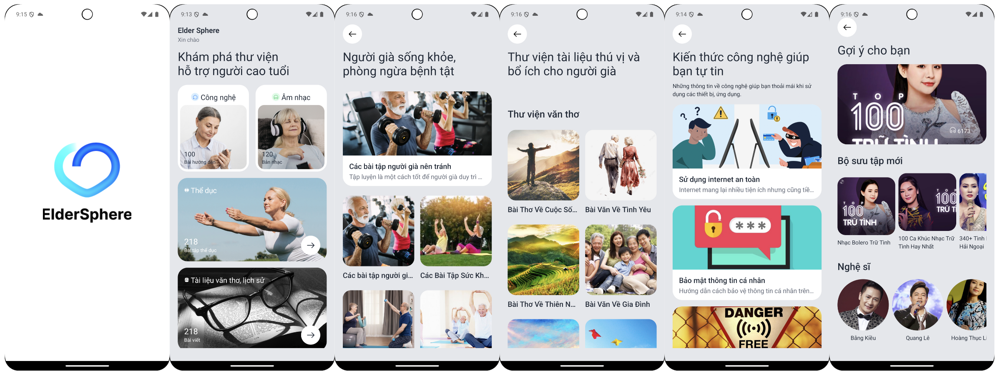

# LOGO

# Elder Sphere - Elder App

## Description
**Elder Sphere** is an innovative application designed specifically to help seniors easily access technology and enjoy a variety of entertaining and educational content. The app’s features are tailored to enhance the elderly's quality of life, making it easier for them to use modern devices and stay engaged with stimulating content. Here's a breakdown of the key features of the Elder Sphere app:

Elder Sphere works well on both IOS and Android devices.

- **Technology Guides for Seniors**: Step-by-step tutorials are provided to help seniors get comfortable using smartphones and tablets, making technology more accessible to them.
- **Relaxing Music and Bolero Songs**: A curated selection of soothing music, including classic bolero tracks, helps seniors unwind and enjoy moments of relaxation.
- **Exercise Routines for Seniors**: A collection of easy-to-follow exercise routines specifically designed to promote the physical well-being of older adults, helping them stay healthy and active.
- **Literature and History Content**: Seniors can enjoy a rich library of literary works and historical documents, providing a source of relaxation and intellectual engagement.

## Technologies Used:
- **React Native** is used for building a smooth and responsive mobile interface that works on both Android and IOS, ensuring seniors can access the app easily on different devices.
- **Redux Toolkits** ensures efficient state management across the application, providing seniors with a smooth, uninterrupted user experience.
- **Expo Router** is utilized to simplify navigation throughout the app, offering seniors an intuitive way to move between sections and easily find what they need.
- **Native Wind** provides styling, making the app visually appealing and easy on the eyes, especially for seniors who may struggle with vision issues.
- **Firebase**:
  - **Realtime Database** enables live updates to technology guides, music playlists, exercise routines, and more, ensuring that seniors always have access to the latest content.
  - **File Storage** stores large amounts of content, like music and reading materials, allowing seniors to access a diverse range of media without overwhelming their device storage.

# Demo
[(./)](https://firebasestorage.googleapis.com/v0/b/food-donation-98ef2.appspot.com/o/QuynhNhu%2FScreen_recording_20241029_072118.mp4?alt=media&token=e2d6663a-ee7f-4e12-a40c-f30e4f42358b)
